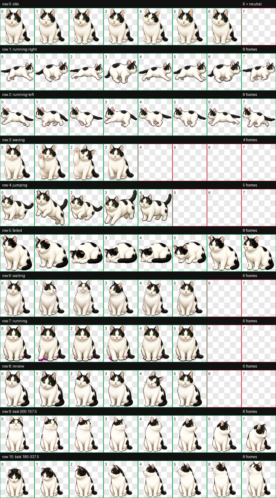

# kwakdoo8

`kwakdoo8` is a custom black-and-white cat Pet for the ChatGPT/Codex desktop app, modeled after 곽두팔 (두팔).

The public repository contains only the distributable Pet package, versioning metadata, and installation documentation. Private source photos, personal workspace notes, and rejected generation artifacts are intentionally excluded.



## Install

Requirements:

- macOS
- ChatGPT/Codex desktop app with custom Pet support
- Bash

Clone the repository and install the latest published version:

```bash
git clone https://github.com/geonha-gorgeous/kwakdoo8.git
cd kwakdoo8
./scripts/install.sh
```

Restart or refresh the desktop app, then select `두팔` from the Pet list.

## Install or roll back to a specific version

Every released package is immutable under `versions/`. Reinstalling an older version provides a deterministic rollback:

```bash
./scripts/list-versions.sh
./scripts/install.sh v1.0.0
```

Before overwriting the active package, the installer saves it under:

```text
~/.codex/pets/.dupal-backups/<timestamp>/
```

Git tags and GitHub Releases use the same semantic version, such as `v1.0.0`.

## Current release

- Version: `v1.0.0`
- Pet ID: `dupal`
- Display name: `두팔`
- Sprite contract: v2
- Atlas: 8 columns × 11 rows
- Cell: 192 × 208 px
- Full spritesheet: 1536 × 2288 px
- Format: transparent WebP
- SHA-256: `022203d0e0c30a7896e3b985250e681efa6f62f70b9c57ba281c9c722f2d9f8e`

See [the state map](docs/STATE-MAP.md) for the animation semantics and [the asset specification](docs/ASSET-SPEC.md) for the row contract.

## Development and releases

Released directories are immutable. A visual revision gets a new semantic version and Git tag, so an experiment can always be undone by reinstalling the previous version. See [CONTRIBUTING.md](CONTRIBUTING.md).

## License

MIT. See [LICENSE](LICENSE).
